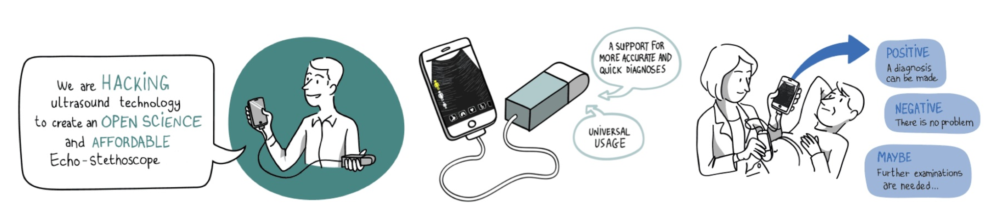

#  AN OPEN SOURCE AND COMMUNITY-BASED PROJECT

echOpen is an open and collaborative project and community, led by a multidisciplinary core of experts and senior professionals with the aim of designing a functional low-cost (affordable) and open source echo-stethoscope (ultrasound probe) connected to a smartphone, allowing the radical transformation of diagnostic orientation in hospitals, general medicine and medically underserved areas. This initiate is aimed for health professionals from southern and northern countries.

# JOINING THE PROJECT

If you wish to join this community, this guide can help you understand the project and its main goals. With this guide, we aim to accompany you to contribute to the echOpen project (by installing your own hardware kit and/or your dev environement with the support of the expertise and experience of the echOpen community). 

Enjoy your reading !

**echOpen community**

For more details, please visit [echopen.org](http://echopen.org/) and join us on Slack, Facebook and Twitter. 

> Illustrations for echOpen [CC BY NC ND](https://creativecommons.org/licenses/by-nc-nd/3.0/): Drawings by Barbara Govin / Storyboard by Ermete Mariani 