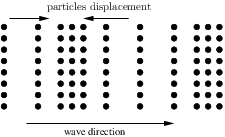
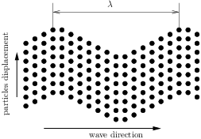
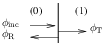

# Acoustic imaging (basics) 

The pdf version of this document can be download ['here'](./acoustic_imaging_src/acoustic.pdf).

In this section, we will explain some basis of the acoustic theory to understand the propagation of acoustic waves and the echographic process.

Propagation of acoustic waves
=============================

In this section, we will define the different types of acoustic waves and some basic equations and properties of the propagation of acoustic waves.

Wave types
----------

An acoustic wave is a perturbation of the local state without displacement of the global state. Acoustic waves are periodic, their spatial periodicity is given by the wavelength *λ*. Consider a medium at rest such as on Fig. 1, where the particles are represented by the dots. Such a periodic structure represent a metal for example. When an acoustic wave propagate in this medium, the particles will have a local displacement.

<figure>
  
  <figcaption> *Figure 1: Medium at rest.* </figcaption>
</figure>

There is two types of acoustic waves, the longitudinal waves (Fig. 2) also named P waves and the transverse waves (Fig. 3) also named SH or SV waves. The longitudinal waves are compressional waves, the direction of the displacement of the particles is the same than the direction of propagation of the wave. The transverse waves are shear waves, the direction of displacement is then perpendicular to the direction of propagation of the wave. In a fluid, such as the water, only longitudinal waves can propagate. In the human body, the shear modulus is very small, it can be considered as a fluid, and so only longitudinal waves will be generated.

<figure>
  
  <figcaption> *Figure 2: Longitudinal wave.* </figcaption>
</figure>

In the rest of the document, we will only consider longitudinal waves.

<figure>
  
  <figcaption> *Figure 3: Shear wave.* </figcaption>
</figure>

Mathematical formulation
------------------------

In acoustic, a fluid medium is describe by two mecanical parameters: the mass density *ρ* and the bulk modulus *κ*. The bulk modulus relate the change of volume of a medium to the isostatic pressure apply on it. The velocity of the acoustic wave *c* is:

begin{equation}
 c=\sqrt{\dfrac{\kappa}{\rho}},
 \label{eq:speed of sound}
\end{equation}

 for example, for the water we have: *ρ* = 1000 kg.m−3, *κ* = 2.19 MPa and *c* = 1480 m.s−1.

The mathematical formulation is obtained by solving the Helmholtz equation, for exemple, the acoustic pressure *p*(*x*,*t*) can be expressed as:

\begin{equation}
 p\left(x,t\right)=\left(A^{+}\e^{\im kx}+A^{-}\e^{-\im kx}\right)\e^{-\im 
\omega t},
 \label{eq:math 1D formulation}
\end{equation}

$A^{+}\\e^{\\im kx}$ is a wave of amplitude *A*+, propagating toward the positive *x*, $A^{-}\\e^{-\\im kx}$ is a wave of amplitude *A*−, propagating toward the negative *x*. $k=\\dfrac{\\omega}{c}$ is the wavenumber, *ω* = 2*π**f* the angular pulsation and *f* the frequency.

When we make an echographic image, we are intresting only on the intensity of the wave:

\begin{equation}
 I=\dfrac{1}{2}\Re\left[p\left(x,t\right)v^{*}\left(x,t\right)\right],
 \label{eq:acoustic intensity}
\end{equation}

where *v*(*x*,*t*) is the velocity of the particle, and *x*\* represent the complex conjugate of *x*. It can be shown with the Euler’s equation that the intensity is directly proportional to the square modulus of the pressure.

Refraction and diffusion of acoustic waves
------------------------------------------

When an acoustic wave passes from a medium (0) to a second medium (1), a part of the wave is reflected an the over part is transmitted through the interface. When the interface is flat in the point of view of the wave, we have refraction (it is a quasi one dimensional problem, because the wave is reflected on only one direction of the space). When the wave sees the curvature of the interface, the wave is scattered on all the directions of the space, we talk then about diffusion.

### Refraction of a wave

<figure>
  
  <figcaption> <i>Figure 4: Refraction of a wave.</i> </figcaption>
</figure>

