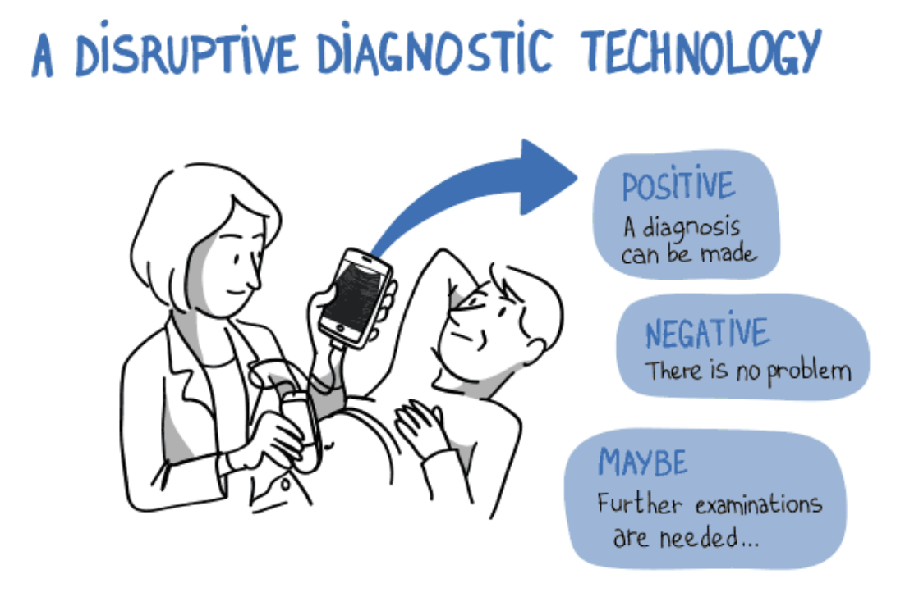
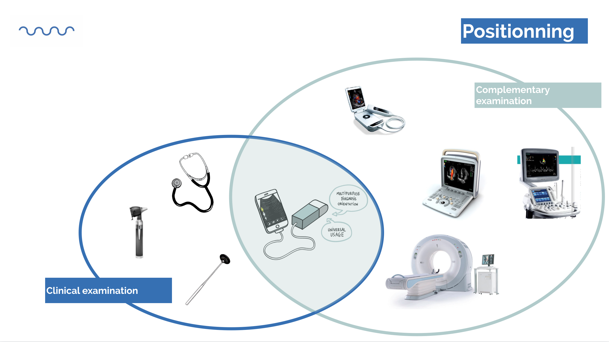

# Echostethoscopy

## Medical definition of echostethoscopy
Use of a **universal** ultra-portable **ultrasound** imaging or **medical visualization** tool, intended to accompany health professionals in clinical practice of **diagnostic orientation**.

Echostethoscopy is primarily aimed at physicians who have never take ultrasound images and who have taken a 48-hour training program to master the gesture and the concept.

## Use of the echostethoscopy

## Medical definition of the tool
In version 0, the probe meets the following criteria to validate a relevant medical use:

The echOpen probe is an internal echo-anatomy visualization tool used in the clinical examination, enabling healthcare professionals to:

- See inside the body
- Find an organ, a vascular structure, ...
- Estimate its volume (large, medium, small) and its dynamics, without tissue analysis
- Supplement clinical semiology for diagnostic guidance for general practitioners and specialists

It is not :

- A complementary review tool
- A per se imaging tool
- A tool for tissue analysis

## Positionning 

## Medical application
Main pathologies that echOpen should cover in general medicine and emergency medicine : 
- Pleural effusion
- Ascites
- Right heart failure 
- Acute pulmonary oedema
- Valvulopathy
- Kidney stones
- Central catheter guidance 

More to come… 