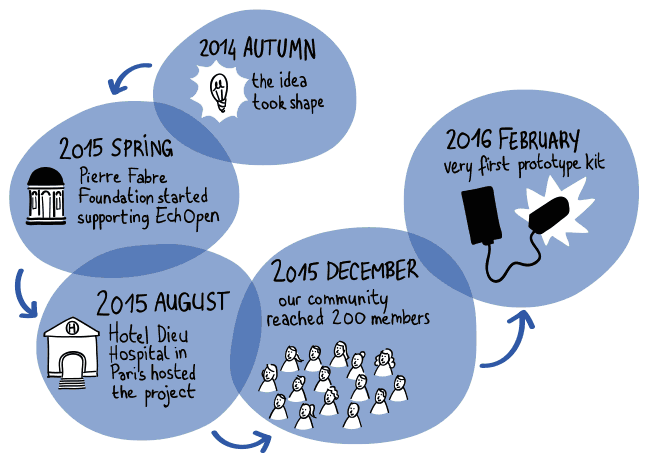

# Project
echOpen is a medical project with a community challenge and a technical outcome. 

# Aim
Designing a **universal**, **open source** and **affordable** medical echo-stethoscope (ultrasound probe) **connected** to a mobile device (smartphone) for **diagnostic orientation** 

# Purpose
Allowing the radical transformation of diagnostic orientation in hospitals, general medicine and medically underserved areas in both southern and northern countries.

# Impact
Better Access To Medical Imaging: **Anytime, anywhere, any moment**

# Objectives 
**Providing healthcare professionals around the world with an affordable echo-stethoscope**

- Medical: Launching a class II.a. medical device 
- Community: pluri-disciplinary collaboration for worldwide open sourced contributions
- Technical: innovative diagnosis solution (low-cost/affordable, open source, etc.)

# Brief history

echOpen was born in late 2014 as a community-based project bringing together people interested in mHealth devices and eHealth for the future of worldwide health. Having gathered a core team of 5 persons with necessary expertise for the project, we tested the feasibility (state of the art, potential applications, etc.). We then mobilized people of various professional backgrounds and partners to create an operational community based around 9 identified specific topics covering the entire project.
