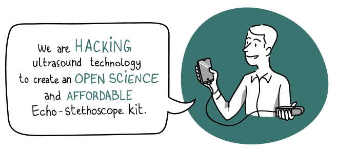
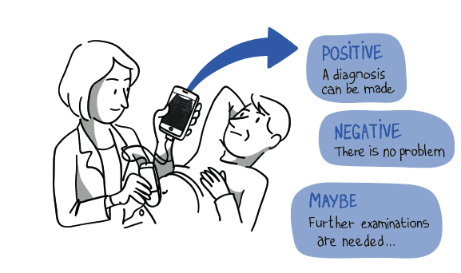
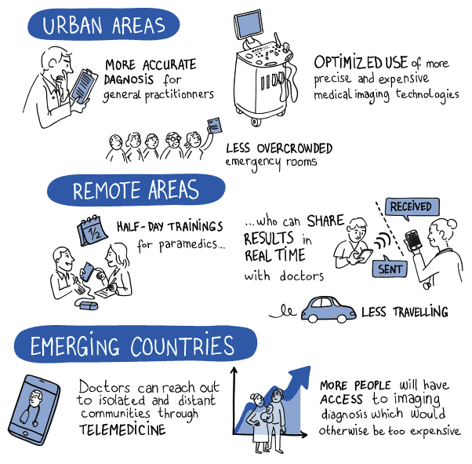

## Aim
Designing a **universal**, **open source** and **affordable** medical echo-stethoscope (ultrasound probe) **connected** to a mobile device (smartphone) for **diagnostic orientation** 

## Purpose
Allowing the radical transformation of diagnostic orientation in hospitals, general medicine and medically underserved areas in both southern and northern countries.

## Impact
Better Access To Medical Imaging: **Anytime, anywhere, any moment**

## Outcomes | March 2017
- 1 lab prototype (kit format split into modules) fully documented
- 1 high quality transducer
- 300+ people in the community (1/3 health professionals) 
- 2 000+ participants in events (workshops, hackathons)
- 5 000+ people reached 
- 10 000+ hours of skills given to the project 

