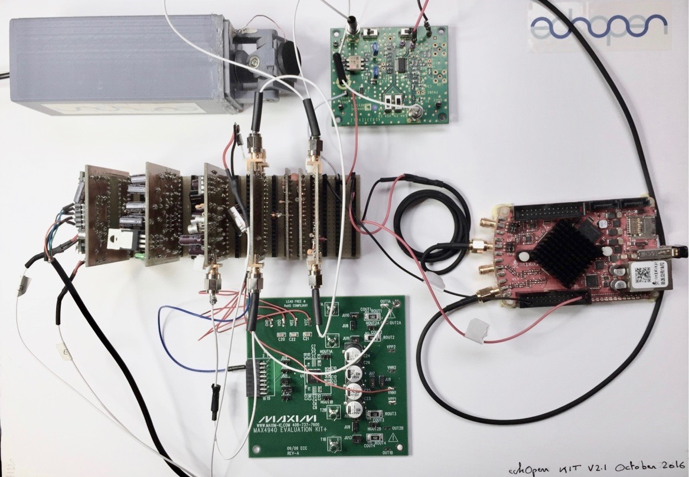

# Laboratory prototype 2.1.0.

This laboratory prototype is the improvement of the former prototype and has been developed with a modular approach allowing anyone interested to build and improve this version by adding, removing, changing any module. 

More information about this prototype, see the [documentation](http://echopen.org/doc-website/CAT-configuration/CFG-sweeping_probe/content). 
