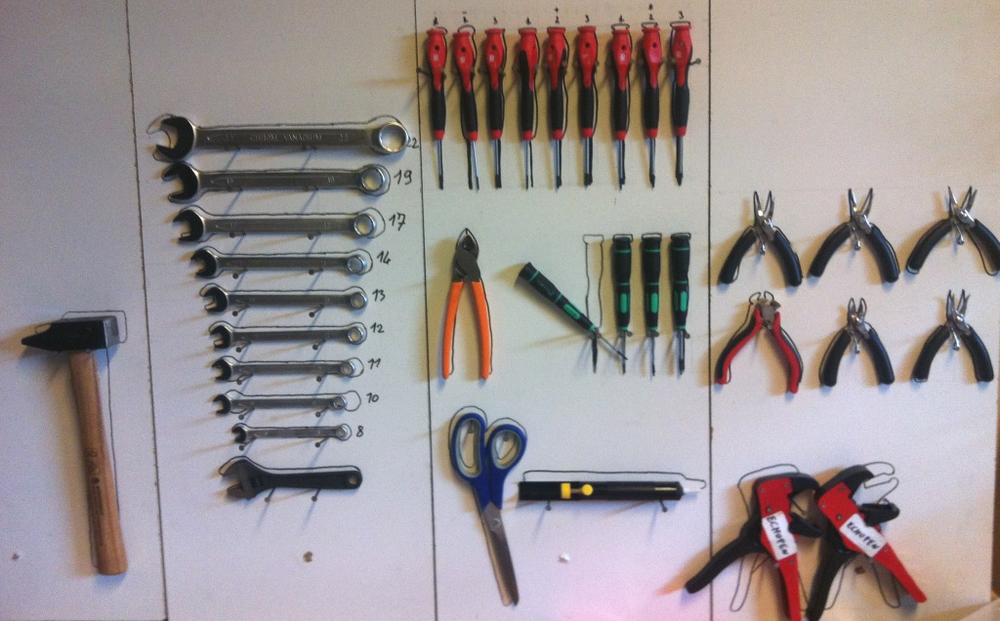
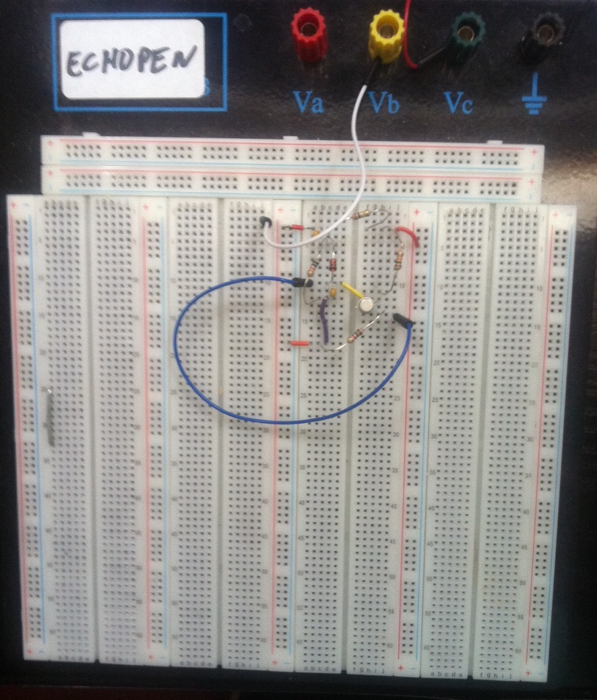
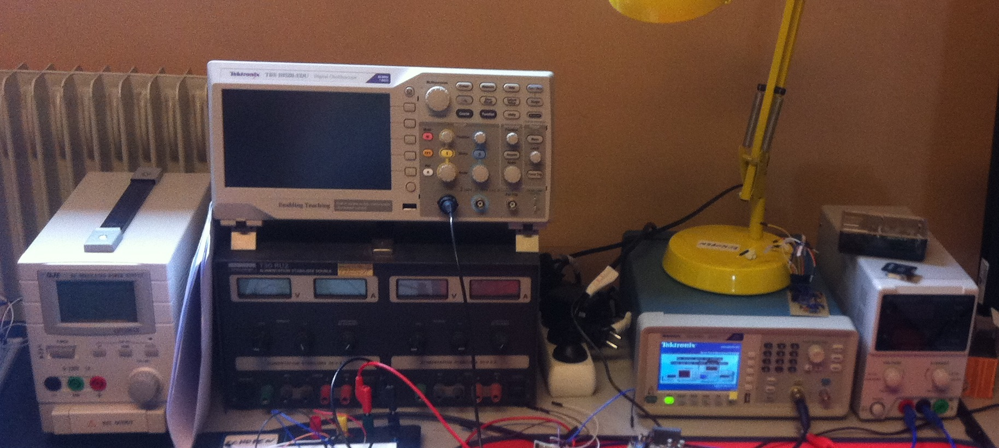

# Set up your echOpen open lab

# Hardware

To build the probe, we have provided some tips for a good start. The following list (LabTool) gives components and consumables deemed essential and required to quickly start a laboratory or a research center to design the echOpen probe.

| **Name** | **Comments** | **Name** | **Comments** |
| --- | --- | --- | --- |
| **TOOLS**
| Heat gun |   | Allen keys set |   |
| Screwdriver set | 1 drive and 35 different heads | Torx keys set | T6, 10, 15, 20, 25 |
| Pliers set | 5 pliers set | Bread Bord | 2560 ports |
|Cutting plier |   | Ventilation | ventilator + duct |
| Wire stripper |   | Multimeter |   |
| Dremel + support | Dremel 4000/support 220: drilling, cutting, sanding | Power supply | 0 - 30 V, 0 - 5 A |
| Caliper |   | Soldering station |   |
| Cutter blades |   | Soldering glasses |   |
| Key set | Size: 8, 10, 11, 12, 13, 14, 17, 19, 22 | desoldering pump |   |
| Sockets and spanners | 2 spanners + sockets 4 to 6 (0.5 step), 7 to 24 (1 step), 27, 30, 32 | Plastic tweezers |   |
| **COMPONENTS AND CONSUMABLES**
| Amplifiers | 10 units | Flux tank | Desoldering wick |
| ADC | 5 units | Soldering mat |   |
| DAC | 5 units (10 MHz, 8 bits) | Resistors set |   |
| Inductors set | 160 inductors from 1µH to 470 µH | Capacitors set |   |
| Prototype board | 160\*100 | Flux bottle (100 mL) |   |
| Crocodile to banana leads |   | Microcontroller | Compatible with Arduino |
| BNC to banana lead |   | Magnifying glass |   |
| Banana to banana leads |   | Motor with encoder | Voltage: 12 V Speed: 500 rpm 1216 steps |
| Wire sets for Breadboard |   | or stepper motor |   Voltage: 12V Speed:450-500 rpm 1080 steps |
| Terminal board |   | Capacitors |   100 pF 470 pF 1000 pF |
| Soldering tin |   | Inductor |   4.7 mH |
| Electronic varnish |   | MOSFET |   |
| Flux cleaner |   | Heat-shrink set |   |

_table 1: labtool_

_Figure 1: Electronic pliers, workshop tools. Method of storage for equipment._

_Figure 2: Typical platform of work: the breadboard_

_Figure 3: Testing appliance_

The oscilloscope and multimeter can be used as electronic diagnostic tools to get quick access to the signals in different parts of the circuit in the board (test leads are required to get measurements on the breadboard). The signal generator allows simulating different inputs to part of the circuit.